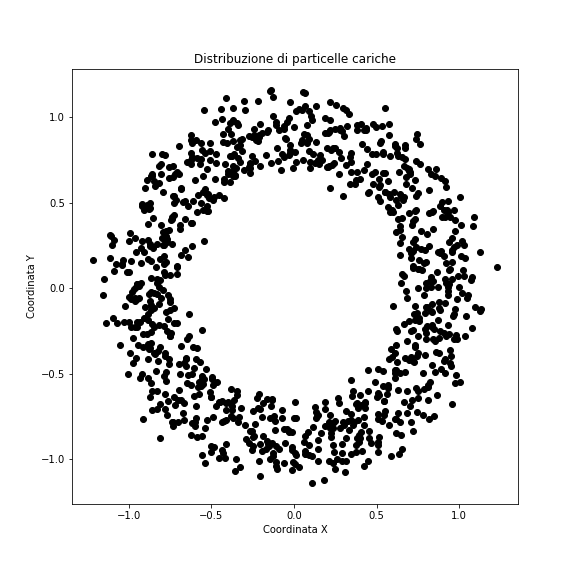

# Laboratorio di informatica (9/12)
### Prof. Stefano Carrazza - Corso C - 2021/22

**Riassunto:** Esercizi di base in C++: caricamento dati e plotting.

Prima di iniziare suggeriamo di create una cartella per questa lezione in cui potete salvare tutti i files che saranno creati per gli esercizi.
```bash
cd ~/           # ci porta alla home directory
mkdir lezione9  # crea la directory sulla vostra home
cd lezione9     # entrate dentro la cartella
```
dopodiché creare un `makefile` con le istruzioni di compilazione per tutti gli esercizi.

## Esercizio 1 - Data loading, funzioni e struct

Consideriamo un file di dati in cui vengono salvate le coordinate cartesiane (x,y) di particelle cariche sotto un campo magnetico con sorgente centrata in origine.

1. Definire una `struct point2d` in cui vengono salvati un puntatore `double *coordinate;` e una variabile `distance` di tipo `double` in file header `funzioni.h`.

2. Scaricare il file che contiene le coordinate `(x,y)` per ogni particella con:
    ```bash
    wget https://raw.githubusercontent.com/scarrazza/informatica2021/master/Lezione_9/data1.dat
    # oppure (se macos)
    curl https://raw.githubusercontent.com/scarrazza/informatica2021/master/Lezione_9/data1.dat -o data1.dat
    ```

3. Implementare un array di struct `point2d` chiamato `punti` di dimensione 1000 (*hint:* su stack), implementare un ciclo in cui ogni per ogni elemento `point2d` il puntatore `coordinate` viene inizializzato come un array dinamico di dimensione 2, in cui il primo valore corrisponde alla `x` e il secondo all'`y` letti da file.

4. Scrivere una funzione `compute_distance` di tipo `void` che prende come argomento 1 `point2d` e calcola la distanza rispetto alla sorgente usando il teorema di Pitagora. Definire questa funzione sul header `funzioni.h` e l'implementazione su un file sorgente `funzioni.cc`.

5. Calcolare la `distanza` media per tutti gli elementi dell'array `punti` tramite una funzione `mean` di tipo `double` che prende come argomento l'array `punti` e la sua dimensione.

6. Ricordarsi di pulire la memoria con attenzione.

## Esercizio 2 - Hello World python script


1. Come primo step, da fare sempre nel nostro laboratorio di calcolo, caricare i moduli python necessari eseguendo da terminale il commando:
    ```bash
    module load python3/anaconda
    ```
    Questo commando puo essere copiato sul vostro `~/.bashrc` in modo che sia sempre attivato automaticamente quanto aprite un nuovo terminale. Altrimenti dovrete lanciare questo commando prima di usare python sulle macchine del laboratorio.
2. Scrivere uno script python, chiamato `plot.py`, che stampi la frase "Hello World!".

3. Eseguire lo script usando l'interprete `python`.


## Esercizio 3 - Scatter plot

Considerando i dati presenti nel file `data.dat` scaricato all'esercizio 1, scrivere uno script in grado di plottare le coordinate dei punti sul piano cartesiano (x,y).

1. Scrivere uno script python, `esercizio3.py`, in cui plottiamo le coordinate dei punti presenti sul file, usando il modulo `numpy` (`numpy.loadtxt`) per caricare i dati e `matplotlib` per eseguire il plot (`matplotlib.pyplot.plot`).

2. Eseguire lo script in modo che il plot venga mostrato su schermo. Verificare che il vostro plot è simile a questo:

    

3. Modificare il titolo del grafico con "Distribuzioni di particelle cariche", e i titoli sugli assi con rispettivamente "Coordinata x" e "Coordinata y".

4. Colorare i punti in rosso.

5. Salvare il plot su disco in formatto PNG con nome file `output.png`.

## Esercizio 4 - Plot di funzioni

Scrivere un programma in C++ in cui:

1. Definite una funzione di tipo `double` che restituisce la formula `f(x) = -sin(x*x)/x + 0.01 * x*x`, dove `x` è l'argomento della funzione.

2. Sul main costruire un array `x` di 100 elementi distanziati linearmente tra [-3, 3].

3. Stampare su file `output.dat` riga per riga le coppie `x` e `f(x)`.

Da questo punto in poi usiamo python per fare il plot:

4. Adattare lo script python precedente in modo da disegnare le coppie stampate precedentemente.

5. Limitare l'asse x del plot tra x=`[-3,3]`.

5. Decorare il plot con titolo, assi, colori e linea che collega i diversi punti. Mostrare l'equazione in legenda.


## Esercizio 5 - Multi-plot

1. Scaricare i dati (x,y,z) con:
    ```
    wget https://raw.githubusercontent.com/scarrazza/informatica2021/master/Lezione_9/data5.dat
    # oppure (se macos)
    curl https://raw.githubusercontent.com/scarrazza/informatica2021/master/Lezione_9/data5.dat -o data5.dat
    ```

2. Scrivere uno script Python in cui caricate le 100 coordinate di punti con `numpy.loadtxt`. Sul file sono presente 3 colonne `x, y, z`.

3. Disegnare i punti `(x,y)` e `(x,z)` usando `matplotlib.pyplot.plot`.

4. Salvare il plot su disco in formato `png`.
